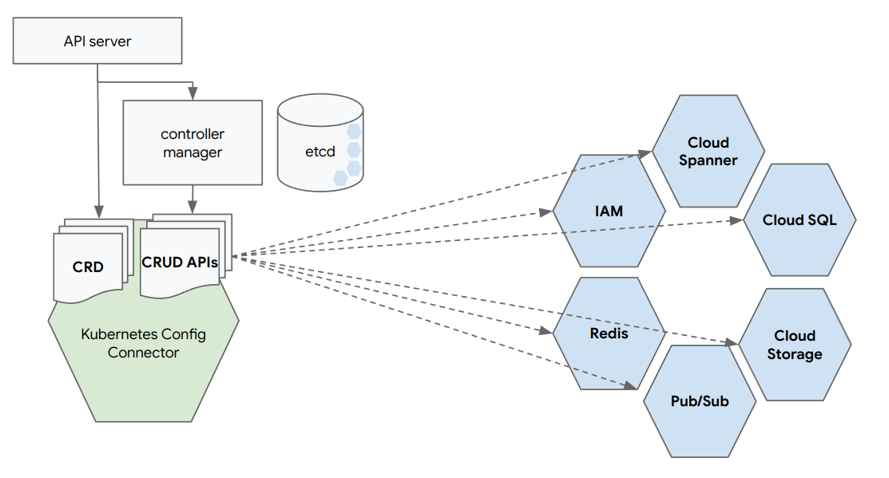
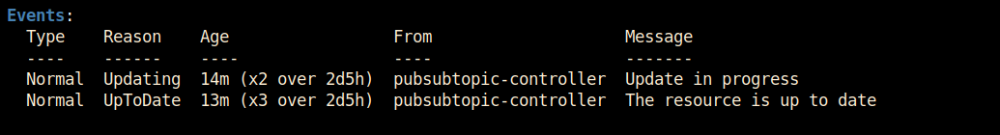

Infrastructure as Code (IaC) helps "cloud native" companies manage their infrastructure based on the principles of software engineering. A wide range of IaC tools and frameworks facilitate in updating the cloud infrastructure. Config Connector is the latest member of this family and brings a new approach based on the power of Kubernetes. In this blog post we outline how it works compared to other tools.

<!--more-->
As companies expand their infrastructure, creating and enforcing consistent configurations and security policies across a growing environment becomes difficult and creates friction. Infrastructure as Code (IaC) helps solve this by automating through code the configuration and provisioning of resources, so that human error is eliminated, time is saved, and every step is fully documented.

IaC applies software engineering practices to infrastructure and brings the same benefits to infrastructure :
1. Automate: Commit, version, trace, deploy, and collaborate, just like source code.
2. Declarative: Specify the desired state of infrastructure, not updates
3. Roll back:  Roll out and roll back changes just like a regular application
4. Validate: Assess desired state vs. current state infrastructure
5. Scale: Build reusable infrastructure blocks across an organization

### Iac Tool landscape

Over the years there’s been an explosion in infrastructure platforms and application frameworks that form the foundation of “cloud native.” The most popular are listed in the table below.

|   	|   Type	| Immutable  	| Declarative   	| Language   	| Google Cloud Support   	|
|---	|---	|---	|---	|---	|---	|
|  Terraform 	|  Provisioning 	|  Yes 	| Yes  	| HCL  	| Yes (*)  	|
|  Config Connector 	|  Provisioning 	| Yes  	| Yes  	| YAML/KRM  	| Yes  	|
|  Pulumi  	|  Provisioning 	| Yes  	| Yes  	| JS, TS, Python, ...  	|   	|
|  Ansible 	|  Config mgmt 	|   	|   	| YAML  	|   	|
|  Chef 	|  Config mgmt 	|   	|   	| Ruby  	|   	|

(*) Support cases can be opened for Google Cloud resources managed via the Google provider.

### Config Connector

Tools like Terraform and Pulumi let admins declare infrastructure in code. But code does not establish a strong contract between desired and current state, and every time code is modified or refactored, a procedural or imperative approach (think: plan/apply) step is required to revalidate the state.

Bring in Kubernetes. 

Controllers are the core of Kubernetes. It’s a controller’s job to ensure that, for any given object, the actual state of the world matches the desired state in the object. 

Config Connector extends the [Kubernetes Resource Model](https://github.com/kubernetes/design-proposals-archive/blob/main/architecture/resource-management.md) with [Custom Resource Definitions (CRD)](https://kubernetes.io/docs/concepts/extend-kubernetes/api-extension/custom-resources/) for GCP services and resources.  
When you install Config Connector on a Kubernetes cluster, a CRD is defined for every service and resource in GCP :

```
➜ kubectl get crd --namespace cnrm-system
NAME                                                                               CREATED AT
accesscontextmanageraccesslevels.accesscontextmanager.cnrm.cloud.google.com        2022-11-29T07:41:51Z
accesscontextmanageraccesspolicies.accesscontextmanager.cnrm.cloud.google.com      2022-11-29T07:41:51Z
accesscontextmanagerserviceperimeters.accesscontextmanager.cnrm.cloud.google.com   2022-11-29T07:41:51Z
apigeeenvironments.apigee.cnrm.cloud.google.com                                    2022-11-29T07:41:51Z
apigeeorganizations.apigee.cnrm.cloud.google.com                                   2022-11-29T07:41:51Z
artifactregistryrepositories.artifactregistry.cnrm.cloud.google.com                2022-11-29T07:41:51Z
backendconfigs.cloud.google.com                                                    2022-11-25T13:06:26Z
bigquerydatasets.bigquery.cnrm.cloud.google.com                                    2022-11-29T07:41:51Z
bigqueryjobs.bigquery.cnrm.cloud.google.com                                        2022-11-29T07:41:52Z
bigquerytables.bigquery.cnrm.cloud.google.com                                      2022-11-29T07:41:52Z
bigtableappprofiles.bigtable.cnrm.cloud.google.com                                 2022-11-29T07:41:52Z
bigtablegcpolicies.bigtable.cnrm.cloud.google.com                                  2022-11-29T07:41:52Z
bigtableinstances.bigtable.cnrm.cloud.google.com                                   2022-11-29T07:41:52Z
bigtabletables.bigtable.cnrm.cloud.google.com                                      2022-11-29T07:41:52Z
billingbudgetsbudgets.billingbudgets.cnrm.cloud.google.com                         2022-11-29T07:41:52Z
binaryauthorizationattestors.binaryauthorization.cnrm.cloud.google.com             2022-11-29T07:41:52Z
binaryauthorizationpolicies.binaryauthorization.cnrm.cloud.google.com              2022-11-29T07:41:52Z
capacityrequests.internal.autoscaling.gke.io                                       2022-11-25T13:05:36Z
cloudbuildtriggers.cloudbuild.cnrm.cloud.google.com                                2022-11-29T07:41:52Z
...
```

Admins can now define the desired state of the infrastructure as data in the Kubernetes `etcd` database using the Config Connector CRDs. The Config Connector `operator` is a controller that will reconcile the actual state of the infrastructure with the desired state in the Kubernetes `etcd` database as defined by the admins.

Config Connector `operator` translates desired declarative state to imperative API calls.



### Example

Let's say we want to create a `pubsub` topic. 

First we need to enable the `pubsub api` on our project. Based on the [serviceusage CRD](https://cloud.google.com/config-connector/docs/reference/resource-docs/serviceusage/service), we can create a YAML file that declares that the service is enabled :

```
apiVersion:     
kind: Service
metadata:
  name: pubsub.googleapis.com
spec:
  projectRef:
    external: projects/my-project-id
```

Store this YAML file as `pubsub-service.yaml` and apply it to your Kubernetes cluster: 
```
kubectl apply -f pubsub-service.yaml
```
Now that the `pubsub` service is enabled, let's create a topic. Based on the [PubSubTopic CRD](https://cloud.google.com/config-connector/docs/reference/resource-docs/pubsub/pubsubtopic), below YAML file `pubsub-topic.yaml` declares a new `pubsub` topic :

```
apiVersion: pubsub.cnrm.cloud.google.com/v1beta1
kind: PubSubTopic
metadata:
annotations:
    cnrm.cloud.google.com/project-id: xke-configconn-demo
labels:
    managed: configconnector
name: cc-managed-topic
```
And apply the file again : 
```
kubectl apply -f pubsub-topic.yaml
```

Head over to your GCP console and verify that a `pubsub` topic called `cc-managed-topic` is actually created. Congratulations, you have declared your configuration as data !

But now for the beauty of Kubernetes and continuous reconciliation ...

Delete the `pubsub` topic manually from your project. The Config Connector `operator` will detect that the actual state is no longer inline with the desired state and will start taking remediation action. Wait a couple of seconds and ... Kubernetes will recreate the topic you manually deleted ! And there was no procedural/imperative step required.

Check the events on the `pubsub` object to verify what happened :



## Conclusion
With Google [Config Connector](https://cloud.google.com/config-connector/docs/overview) we can move to a true declarative approach for infrastructure using Configuration as Data while harnessing the power of Kubernetes.

While Config Connector was released by Google for GCP, we see an adoption of the same principles by other Cloud providers. Microsoft Azure released [Azure Service Operator](https://github.com/Azure/azure-service-operator) and AWS is building around [AWS Controllers for Kubernetes (ACK)](https://github.com/aws-controllers-k8s/community). 

And then there is [Crossplane](https://crossplane.io/) that aims to bring a universal control plane to enable platform teams to assemble infrastructure from multiple vendors.

Is this the new industry trend ? Let's see what the future brings.


